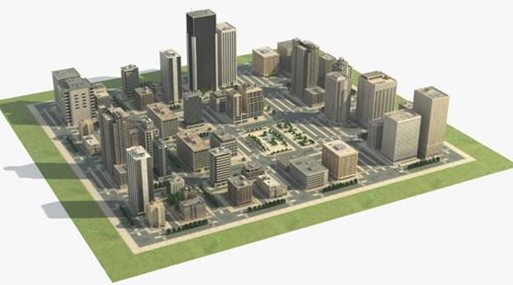

Filler
## Use Case 1 (UC1) - Ride-Hailing: Assisted Car-Human Urban Rendezvous

### Description

A person (the Rider), walking in an urban area asks via an intermediary for a car (the Ride Car) to provide a ride. If a Ride Car is available, it is sent to the meet the Rider. When the Ride Car is close enough to the Rider for them to be mutually visible, a virtual Signs appear over both the Rider and Ride Car to help them find each other. These Signs face each other, rotating and moving in synchronization with the Rider and Ride Car until rendezvous has been achieved at a safe location for a pickup. Arrival at a safe location for pickup is indicated by a change in the appearance of the Signs. At all times, the Signs appear visually as they would if they were physical signs in the real world.

