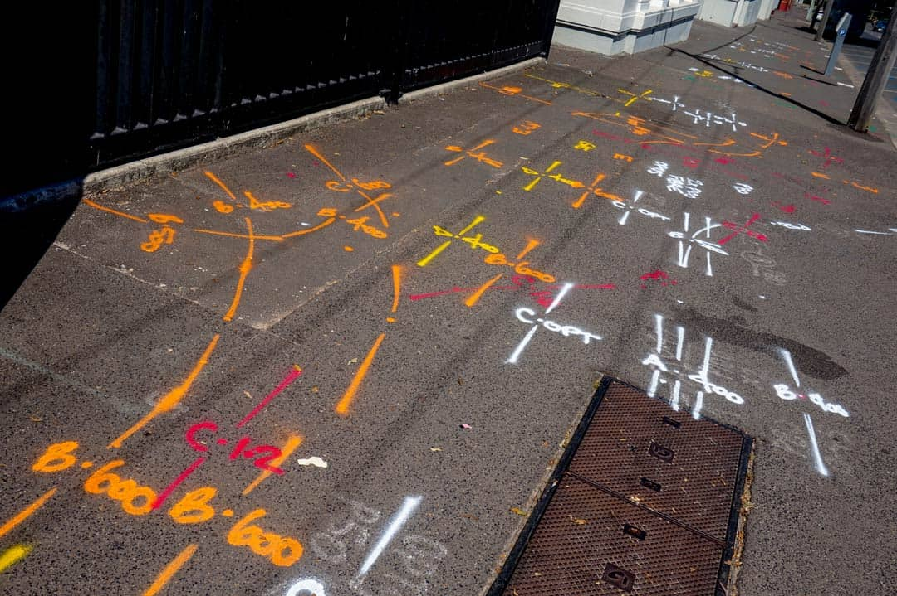

# Use Case 2 (UC2) - Underground Utilities - AR for Reading the Street

## Description

This use case is based on the need to understand what is buried in the ground at a construction site before and during excavations in order to prevent damage and injury. 

A person (the Excavator), marks a proposed excavation in white paint. A person (the Locater) visualizes the excavation using the markings as a specification for the hole. The Locater adds colored paint markings to specify what buried utilities lie beneath the surface. The Excavator returns to excavate according to the proposal. Before and during the excavation, the Excavator can visualize the hidden buried facilities. The visualization evolves during the digging process as some things are exposed and can be directly viewed. The internal representation of the exposed facilities as well as new facilities placed before burial are integrated with previous knowledge of the buried facilities at the location. The result is a continuous integration of images and other data such ground penetrating RADAR returns or as LiDAR point clouds obtained during and after placement ("as-built" imagery) for use during future excavations at or near the same location.

## Integration and Feedback

The location of buried pipes and cables are often only known to different levels of precision as the design and excavation proceed.
1. During the design phase there may be either general records of a buried pipe or cable but only within a wide corridor _or_ there may be "as-built" video or imagery that can be used to provide an integrated view beneath the ground surface.
2. During the location phase, the horizontal precision may be improved to a few tens of centimeters horizontally and a half meter vertically.
3. During excavation, the precise location and condition is exposed within the excavated area.
The integrated virtual/real view can be updated as the work proceeds to provide the best-available information as the work proceeds. Since very approximate information may be replaced by direct observation of the initially hidden buried facilities, it is possible to update the model based on these "as-built" observations so that they may be integrated into a view if a later project involves the same buried objects.

## Benefit of AR for this Use Case

The two key enhancements are
1. enhanced safety from the integration or translation of the pre-existing details of the buried facilities during the excavation and
2. the opportunity to seamlessly merge observations (imagery, video, LiDAR) during excavation, construction or emplacement, and back-filling into the store of detailled information in and near the excavation locality.

